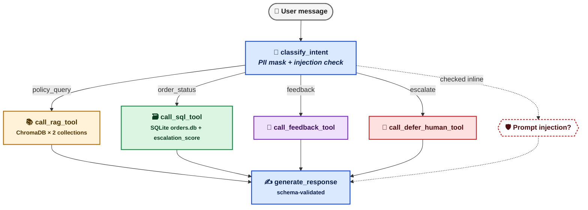

<div align="center">

# 🛒 Cartmind
### Agentic E-Commerce Support Desk

*A grounded, memoried, guarded, and resumable LangGraph agent for e-commerce support*

-ff69b4)


-success)


*Built as a capstone project for the Nykaa (E-commerce & Retail) track.*


</div>

---

> **In one line:** Cartmind answers policy questions from a hand-written knowledge base and looks up real order records — it never invents a policy, and it never leaks a phone number or card digit to the model or the logs.

**Everything in this repo runs API-key-free**, under `MOCK_LLM=true`, with **zero API keys** and **zero network calls**. A real Groq key only matters if you deliberately flip that flag.

---

## 📚 Table of Contents

- [🛒 Cartmind](#-cartmind)
    - [Agentic E-Commerce Support Desk](#agentic-e-commerce-support-desk)
  - [📚 Table of Contents](#-table-of-contents)
  - [1. ⚙️ What This Is](#1-️-what-this-is)
  - [2. 🚫 What This Is Not](#2--what-this-is-not)
  - [3. 🗺️ Architecture at a Glance](#3-️-architecture-at-a-glance)
  - [4. 🗂️ Repository Map](#4-️-repository-map)
  - [5. 🛠️ Setup](#5-️-setup)
  - [6. 🔐 Environment](#6--environment)
  - [7. 🌱 Seed the Data](#7--seed-the-data)
    - [📦 Dataset design (reproduce with `seed=42`)](#-dataset-design-reproduce-with-seed42)
  - [8. 🏪 Run the Desk](#8--run-the-desk)
    - [💻 Terminal agent](#-terminal-agent)
    - [🌐 API + chat frontend](#-api--chat-frontend)
    - [🔌 MCP server + client](#-mcp-server--client)
  - [9. 📊 Run Evals](#9--run-evals)
    - [🏆 Retrieval strategy comparison](#-retrieval-strategy-comparison)
    - [🎯 RAG triad scores (current run)](#-rag-triad-scores-current-run)
  - [10. 🔍 Evidence Map](#10--evidence-map)
  - [11. ⚠️ Known Limits](#11-️-known-limits)
  - [📄 License](#-license)

---

## 1. ⚙️ What This Is

A single **LangGraph** agent —

```
classify_intent → { RAG tool | SQL order-lookup tool | feedback tool | human-defer tool } → generate_response
```

— wrapped in a **FastAPI** backend, a static chat frontend, an **MCP** server, **SQLite checkpointing**, and a 15-query **RAG-triad evaluation harness**.

It routes a message to a knowledge-base answer or an order-status lookup, escalates when a designed `escalation_score` says so, and **every response is validated against a fixed JSON Schema.**

| ✅ Capability | Detail |
|---|---|
| Multi-branch routing | 1 conditional edge fanning out to 5 branches |
| Grounded answers | Extractive RAG — no hallucinated policy |
| Order lookups | Live SQLite query, not scripted responses |
| Guardrails | PII masking + prompt-injection detection |
| Resumability | SQLite-checkpointed, thread-scoped state |
| Validated output | Every response checked against a JSON Schema |

---

## 2. 🚫 What This Is Not

> Being upfront about scope is part of the deliverable — here's exactly where the line is drawn.

| ❌ Not this | Why |
|---|---|
| A live Nykaa/Nimbus integration | The orders database and the 38 policy PDFs are **synthetic**, generated by `scripts/dataset.py` and authored for this capstone |
| A payments / NEFT / bank integration | No financial rails are touched anywhere in the system |
| An OCR pipeline | The 38 knowledge-base files are already machine-readable PDFs, loaded via `PyPDFDirectoryLoader` |
| A guarantee of "real intelligence" under `MOCK_LLM=true` | Grounded answers are **extractive** (built only from retrieved chunks); the structured ticket is built **deterministically** from intent + tool output. Flip `MOCK_LLM=false` + supply a Groq key for a real model in the loop |
| A masker for name/address PII | Free text has no reliable pattern to match under a keyless masker — this is an **acknowledged, documented gap** (see [§11](#11-️-known-limits)). Only fabricated examples are used anywhere in this repo |

---

## 3. 🗺️ Architecture at a Glance



**6 nodes · 1 real conditional edge** (`classify_intent` fans out on `state["intent"]` to 5 branches) · every node wrapped in a `RetryPolicy` · the whole graph checkpointed to **SQLite** by `thread_id`.

---

## 4. 🗂️ Repository Map

A guided tour of the codebase — what lives where, and why.

```text
cartmind-agentic-ecommerce-support/
│
├── config/                     # RAG + response-generation configuration
├── data/
│   ├── database/               # SQLite order database
│   └── policy_docs/             # Nimbus Commerce policy knowledge base
│
├── eval/
│   ├── golden/                  # Golden inputs / test sets
│   ├── results/                 # JSON / CSV evaluation outputs
│   ├── insights/                # Evaluation demonstrations + analysis
│   └── scripts/                 # Evaluation runners
│
├── frontend/                    # Browser UI
├── mcp_server/                  # MCP server + interoperability client
├── prompts/                     # RAG + response-generation prompts
├── schema/                      # Structured response schema
│
├── scripts/
│   ├── dataset.py               # Deterministic 50-record generator
│   └── seed.py                  # SQLite + Chroma seeding
│
├── src/
│   ├── agent/                   # LangGraph + FastAPI
│   ├── guardrails/              # PII + injection controls
│   ├── memory/                  # Conversation persistence
│   ├── observability/           # JSONL + MLflow tracing
│   ├── rag/                     # Loading, chunking, embeddings, retrieval
│   ├── resilience/              # Timeout handling
│   ├── structured_output/       # Safe parsing + validation
│   └── tools/                   # RAG, SQL, feedback, deferred tools
│
├── storage/                     # Local runtime state
├── pyproject.toml               # Python 3.13 project metadata
├── requirements.txt             # Locked dependency versions
└── README.md                         # Apache 2.0
```

> 💡 **Where to start reading:** `src/agent/graph.py` → `src/agent/nodes.py` gives you the whole control flow in two files. From there, follow whichever branch you care about (`src/rag/`, `src/tools/`, `src/guardrails/`).

---

## 5. 🛠️ Setup

> Requires **Python 3.13**.

```bash
python -m venv .venv
source .venv/bin/activate          # Windows: .venv\Scripts\activate
pip install -r requirements.txt
cp .env.example .env
```

<details>
<summary>⚠️ <b>Heads-up on <code>requirements.txt</code> encoding</b> (click to expand)</summary>

<br>

It was frozen from a Windows/PowerShell environment and is saved as **UTF-16**. Most `pip` builds read it fine, but if your install fails with a decode error:

```bash
iconv -f utf-16 -t utf-8 requirements.txt -o requirements.txt
```

— or install from `pyproject.toml`'s dependency list instead. Same versions either way.

</details>

---

## 6. 🔐 Environment

```text
# .env.example — safe to commit
MOCK_LLM=true
api_key=
```

Copy it to `.env` and **leave `api_key` blank** for every graded path in this repo — `MOCK_LLM=true` is the default in `src/llm_client.py` even if `.env` is missing entirely.

Only set `MOCK_LLM=false` and fill `api_key` (a **Groq** key) if you want `config/rag_tool.json` / `config/response_generator.json`'s real models (`openai/gpt-oss-120b`, `qwen/qwen3.8-27b`) in the loop instead of the mock.

> 🔒 **Never commit a filled `.env`.** `.gitignore` already excludes it — keep it that way.

---

## 7. 🌱 Seed the Data

```bash
python scripts/seed.py
```

This calls `generate_order_dataset(num_records=50, seed=42)`, writes **50 rows** into `data/database/orders.db`, and calls `build_storages()` to chunk + embed the **38 policy PDFs** in `data/policy_docs/nimbus_kb_split_by_topic/` into **two** separate Chroma collections (`kb_fixed_size`, `kb_sentence_based`) under `storage/vector_databases/`.

### 📦 Dataset design (reproduce with `seed=42`)

| Category | Price range (₹) | Reasoning |
|---|---|---|
| 👕 Apparel | 500 – 5,000 | moderate clothing prices |
| 💻 Electronics | 2,000 – 30,000 | mid-range gadgets to small appliances |
| 🏠 Home | 300 – 8,000 | homeware, decor, small furniture |
| 👟 Footwear | 700 – 6,000 | shoes, sandals, boots |
| 💄 Beauty | 100 – 2,500 | cosmetics, skincare, personal care |

`delayed_shipment` is drawn as `random.random() < 0.2` per record.

**Actual generated split with `seed=42`, 50 records** (`python scripts/dataset.py`):

| By Category | Count | | By Status | Count |
|---|---|---|---|---|
| Apparel | 12 ✅ | | Shipped | 14 ✅ |
| Beauty | 12 ✅ | | Placed | 12 ✅ |
| Home | 10 ✅ | | Refunded | 11 ✅ |
| Footwear | 9 ✅ | | Delivered | 9 ✅ |
| Electronics | 7 ✅ | | Returned | 4 ✅ |

*(all categories ≥ 3, all statuses ≥ 1 — targets met ✓)*

**Delayed shipments:** `20.00%` — within target band of 10–30% ✓

---

## 8. 🏪 Run the Desk

### 💻 Terminal agent
*Multi-turn, persisted JSON memory, resumable*

```bash
python -m src.agent.terminal_application
```

| Command | Effect |
|---|---|
| `history` | print persisted memory for the thread |
| `clear` | delete it |
| `exit` | quit |

### 🌐 API + chat frontend

```bash
uvicorn src.agent.main:app --reload --port 8000
```

Then open `frontend/index.html` in a browser (it talks to `http://localhost:8000` by default — see `frontend/app.js`).

**Key endpoints**, all Pydantic-typed:

| Method & path | Purpose |
|---|---|
| `GET /api/health` | liveness check |
| `POST /api/chat` | send a message, get the agent's schema-validated answer |
| `GET /api/threads` | list threads for the sidebar |
| `GET /api/threads/{id}/messages` | full history of one thread |
| `GET /api/threads/{id}/state` | is this thread interrupted mid-run? |
| `POST /api/threads/{id}/resume` | continue an interrupted run from its checkpoint |
| `DELETE /api/threads/{id}` | delete a thread's history |
| `POST /api/documents/upload` | upload a PDF, re-embed it into the KB |

> 📝 Every `/api/chat` and `/api/threads/{id}/resume` call writes one masked, trace-ID'd JSON-Lines entry to `logs/agent_run/requests.jsonl`.

### 🔌 MCP server + client
*Separate processes, real round trip*

```bash
python mcp_server/server.py                 # SSE transport on :8000/sse
python eval/scripts/mcp_client.py           # separate process; calls check_order_status
```

<details>
<summary>ℹ️ <b>Transport note</b> (click to expand)</summary>

<br>

This server binds `fastmcp`'s **SSE** transport at `/sse`, not the newer HTTP-streamable default at `/mcp` some `fastmcp` docs describe — `mcp_server/client.py` and `eval/scripts/mcp_client.py` are already pointed at the right path (`http://127.0.0.1:8000/sse`), so just run server then client as shown.

⚠️ Run the API (`uvicorn`, above) on a **different port** if you run both at once — they default to the same `:8000`.

</details>

---

## 9. 📊 Run Evals

```bash
# Part 1 — threshold calibration + Precision@3/Recall@3 for both chunking strategies
python eval/scripts/part1_task45.py
# -> eval/results/part1_task45.json, eval/insights/part1_task45_demonstration.md

# Part 2/4 — memory, PII mask, injection guardrail, retry, timeout, all in one script
python eval/scripts/missing_implementations_demo.py
# -> eval/results/demonstrations/missing_implementations_results.json

# Part 3 — RAG triad (context relevance / groundedness / answer relevance) over 15 queries
python eval/scripts/rag_triad_evaluation_mock.py
# -> eval/results/rag_eval_results/with_mock_llm/rag_triad_evaluation_results_mock.json
```

> Expected **shape**, not exact wording — scores are deterministic under `MOCK_LLM=true` but will reprint every run.

| Script | What it prints |
|---|---|
| `part1_task45.py` | A calibrated threshold and per-query Precision@3/Recall@3 for both `kb_fixed_size` and `kb_sentence_based` |
| `missing_implementations_demo.py` | Five `PASS`-style sections — memory present, memory absent (fresh thread), PII masked, injection blocked, retry recovered, timeout fired clean |
| `rag_triad_evaluation_mock.py` | 15 rows of three 0–1 scores plus the three averages |

### 🏆 Retrieval strategy comparison

Both chunking strategies were evaluated on the same 5 in-scope + 2 out-of-scope queries and — on this dataset — land on **identical aggregate numbers**:

| Metric | `kb_fixed_size` | `kb_sentence_based` |
|---|---|---|
| Precision@3 | ≈ 0.24 | ≈ 0.24 |
| Recall@3 | ≈ 0.71 | ≈ 0.71 |

*(full per-query table in `eval/insights/part1_task45_demonstration.md`)*

Given no separation in retrieval quality, **`kb_fixed_size` is the recommended collection to deploy** — it's the one already wired into `src/rag/retrieval.py` and the upload pipeline in `src/agent/main.py`, so it's the path that's actually exercised end to end.

### 🎯 RAG triad scores (current run)

| Metric | Score |
|---|---|
| Avg. Context Relevance | **0.63** |
| Avg. Groundedness | **0.94** |
| Avg. Answer Relevance | **0.48** |
| **Overall** | **0.68** |

---

## 10. 🔍 Evidence Map

*Everything a reviewer needs, cross-referenced to its source of truth.*

| Requirement | Where to look |
|---|---|
| Dataset validation report | `python scripts/dataset.py` (stdout) |
| Knowledge base (38 PDFs, ≥12 required topics) | `data/policy_docs/nimbus_kb_split_by_topic/` |
| Both chunking strategies, two Chroma collections | `storage/vector_databases/` (built by `scripts/seed.py`) |
| Threshold calibration + P@3/R@3 for both strategies | `eval/results/part1_task45.json`, `eval/insights/part1_task45_demonstration.md` |
| `check_order_status` + escalation score | `src/tools/sql_tool.py`, `mcp_server/server.py` |
| LangGraph graph (6 nodes, conditional routing) | `src/agent/graph.py`, `src/agent/nodes.py` |
| Persisted memory (present + fresh-thread absent) | `storage/conversation/conversations.json`, `eval/results/demonstrations/missing_implementations_results.json` |
| Structured output schema | `schema/agent_response.json`, `src/structured_output/validate_ticket.py` |
| Guardrails firing | `src/guardrails/pii.py`, `src/guardrails/injection.py`, `eval/results/demonstrations/missing_implementations_results.json` |
| FastAPI, ≥2 endpoints | `src/agent/main.py` |
| Structured JSON-Lines logs, masked, trace ID | `logs/agent_run/requests.jsonl` |
| RAG triad × 15 queries + averages | `eval/golden/nimbus_rag_golden_test_set_15.json` → `eval/results/rag_eval_results/with_mock_llm/rag_triad_evaluation_results_mock.json` |
| MCP round trip on ≥2 record IDs | `eval/golden/mcp_golden_record_ids.json` → `eval/scripts/mcp_client.py` → `eval/results/mcp_results.json`, `eval/insights/mcp_demonstration.txt` |
| SQLite checkpointing (resume without re-execution) | `storage/checkpoints/checkpoints.sqlite`, `src/agent/graph.py` (`SqliteSaver`), `/api/threads/{id}/state` + `/resume` |
| Retry policy + per-node/global timeouts | `src/agent/graph.py` (`RetryPolicy` per node), `src/resilience/timeouts.py`, `eval/results/demonstrations/missing_implementations_results.json` |

---

## 11. ⚠️ Known Limits

Honest scoping of what this system does **not** yet do:

- 🔤 **Intent routing is keyword-based** (`classify_intent` in `src/agent/nodes.py`), not a classifier — a message containing "order" always routes to the SQL tool, even in a sentence that's really a policy question about orders.
- 🕵️ **PII masking covers phone numbers and card digits only** (`src/guardrails/pii.py`). Customer name and delivery address are explicitly out of scope for a keyless, pattern-based masker — don't put real personal data into any test query.
- 🧪 **Prompt-injection detection is a fixed keyword list** (`src/guardrails/injection.py`) — it will not catch a rephrased or obfuscated injection attempt.
- 🔁 **The upload endpoint re-embeds the entire knowledge base**, not just the new file, on every `POST /api/documents/upload` call — fine for a 38-document KB, not fine at scale.
- 🔌 **The MCP server and the FastAPI app both default to port 8000** — run them one at a time unless you change one of the ports first.
- 🔑 **A real Groq key must never be committed.** `.env` is git-ignored; if you ever find a live key inside this repo's history, rotate it immediately and remove it from history before making the repo public.

---

## 📄 License

**Apache 2.0** — see [`LICENSE`](./LICENSE).

